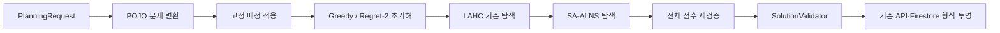

# OptaPlanner 단계적 제거 및 POJO 솔버 전환 실행 계획

- 작성일: 2026-07-15
- 작업 브랜치: `solve-pojo-upgrade`
- 문서 상태: 요구사항 확정본
- 현재 작업 범위: 계획 문서 작성만 수행하며 소스 코드는 수정하지 않음
- 최종 목표: OptaPlanner 의존성을 제거하고 Java 21 기반 자체 Nurse Rostering 엔진으로 전환

## 1. 결정사항 요약

### 1.1 목표

OptaPlanner를 즉시 제거하지 않고 다음 순서로 단계적으로 전환한다.

1. 기존 동작과 점수 의미를 테스트로 고정한다.
2. OptaPlanner 애노테이션과 타입에 독립적인 POJO 도메인·점수 계층을 만든다.
3. 기존 OptaPlanner 엔진과 신규 POJO 엔진을 동일 인터페이스 뒤에서 공존시킨다.
4. LAHC(Late Acceptance Hill Climbing)로 신규 엔진의 정확성과 기본 탐색 능력을 검증한다.
5. SA-ALNS(Simulated Annealing acceptance + Adaptive Large Neighborhood Search)를 목표 알고리즘으로 구현한다.
6. 실제 운영 입력을 이용해 shadow 비교와 점진적 전환을 수행한다.
7. 전환 기준을 충족하면 OptaPlanner 코드·설정·의존성을 제거한다.

### 1.2 완료 기준

- 대표 데이터셋의 모든 실행에서 hard score가 `0`이다.
- 동일한 실행시간과 실행환경에서 POJO 엔진의 soft score 벡터 중앙값이 OptaPlanner 기준선보다 나빠지지 않는다.
- REST API, Firestore 필드, 결과 JSON의 기존 계약을 유지한다.
- 같은 입력·설정·random seed·후보 평가 횟수로 실행하는 결정론 프로필에서는 같은 assignment와 점수를 재현한다. 벽시계 제한 프로필은 종료 시점의 미세한 차이 때문에 비트 단위 재현성을 보장하지 않고, 항상 검증된 best 반환만 보장한다.
- 엔진 선택, shadow 실행, 점진적 전환, 모니터링, 롤백 절차가 준비되어 있다.
- 최종 단계에서 production/test classpath에 `org.optaplanner` 참조가 남지 않는다.

### 1.3 범위

포함 범위:

- 모델의 OptaPlanner 애노테이션 제거를 위한 POJO 경계 설계
- 자체 점수 모델과 전체·증분 제약 평가기
- 초기해 생성, LAHC, SA-ALNS
- 고정 배정, warm start, 중간 결과 callback, 시간·반복 종료 정책
- 기존 점수 저장 필드와 API 응답 호환
- 운영 데이터 기반 differential benchmark
- feature flag, shadow mode, 관측성, 롤백 설계
- OptaPlanner Maven 의존성과 전용 코드의 최종 제거

NOT in scope (제외 범위):

- 이 계획 작성 단계에서의 Java·설정·테스트 코드 수정
- 실제 Cloud Run 배포 및 운영 트래픽 전환 실행
- 기존 REST 요청·응답 스키마의 기능 확장
- 근무 정책이나 점수 우선순위 자체의 재설계
- 외부 수리 최적화/솔버 라이브러리 도입

## 2. 현재 기준선과 선행 조건

### 2.1 현재 OptaPlanner 결합 지점

| 영역 | 현재 결합 | 전환 방향 |
|---|---|---|
| 빌드 | `pom.xml`의 OptaPlanner BOM, Quarkus, Jackson, test 의존성 | 최종 단계에서 모두 제거 |
| 도메인 | `EmployeeSchedule`, `Shift`, `Employee`, `Availability`의 planning 애노테이션 | 외부 라이브러리 애노테이션이 없는 POJO로 전환 |
| 점수 | `BendableScore` 1 hard/4 soft | `RosterScore`로 대체하고 직렬화 경계에서 기존 필드로 변환 |
| 제약 | `EmployeeSchedulingConstraintProvider`의 Constraint Streams | 제약별 순수 Java evaluator로 분해 |
| 실행 | `SolverRunner`가 `SolverFactory`와 `SolverConfig`를 직접 생성 | `SolverEngine` 인터페이스를 통해 엔진 선택 |
| 고정 배정 | `ShiftPinningFilter` | `PlanningProblem` 생성 시 변경 가능 여부를 명시적으로 계산 |
| 증분 실행 | OptaPlanner warm start와 반복 solve | 자체 search state 복제·재개 및 best snapshot 사용 |
| 저장/API | `JobExecutionService`가 `BendableScore`를 Firestore 필드로 변환 | 엔진 중립 `ScoreProjection`으로 대체 |
| 테스트 | `ConstraintVerifier`, `BendableScore` 직접 사용 | evaluator contract, differential, benchmark 테스트로 교체 |

### 2.2 현재 점수 계약

현재 소스의 유효 점수 구조는 `1 hard + 4 soft`이며, 비교는 앞 레벨부터 우선하는 사전식 순서를 유지해야 한다.

| 순서 | 의미 | 방향 |
|---|---|---|
| hard[0] | 필수 제약 위반 | `0`이 feasible, 음수일수록 나쁨 |
| soft[0] | 야간 후 32시간 휴식 | 큰 값이 우수 |
| soft[1] | 기피일 배정 | 큰 값이 우수 |
| soft[2] | 야간·휴일·주/저녁 형평성 통합 | 큰 값이 우수 |
| soft[3] | 희망일 배정 | 큰 값이 우수 |

Firestore/API 하위 호환 필드인 `night48RestSoftScore`, `threeConsecutiveNightSoftScore`, `burdenFairnessSoftScore`, `fairSoftScore`도 현재 매핑 의미를 그대로 보존한다. 이름이 현재 실제 제약과 다르더라도 마이그레이션 중 임의로 삭제하거나 재해석하지 않는다.

### 2.3 구현 시작 전 선행 조건

현재 브랜치에는 계획 문서 작성 전부터 다음 미커밋 변경이 존재한다.

- `src/main/java/org/acme/service/JobExecutionService.java`
- `src/main/java/org/acme/solver/SolverRunner.java`
- `src/main/resources/application.properties`

Phase 0 시작 전에 이 변경을 독립 커밋으로 확정하거나 별도 브랜치로 분리한다. POJO 전환 구현이 해당 변경을 덮어쓰거나 변경 목적을 추측해 재작성해서는 안 된다.

### 2.4 이미 존재하는 재사용 기반(What already exists)

| 기존 코드/흐름 | 재사용 판단 | 주의사항 |
|---|---|---|
| `EmployeeScheduleBuilder`, `ShiftFactory` | 마이그레이션 중 입력 변환 기준선으로 재사용 | 최종 POJO core가 기존 OptaPlanner 모델에 역의존하지 않도록 mapper 경계에서만 사용 |
| `ShiftDateMatcher` | 야간 실제일/논리일 정책의 단일 기준으로 재사용 | 현재 `Shift` 타입 의존성은 Phase 2에서 값 기반 정책 함수로 분리하고 양쪽 adapter가 호출 |
| `SolutionValidator`와 개별 validator | 최종 결과의 독립 방어선으로 유지 | 점수 evaluator의 대체물이 아니며, preceptor hard 제약까지 누락 없이 확장 필요 |
| `RequestValidator` | 명백한 입력 모순과 일자별 용량 부족의 조기 거절에 재사용 | 일자별 독립 용량 검사는 전체 기간의 스킬·휴식 결합 feasibility를 증명하지 못함 |
| `ConstraintVerifier` 테스트 | POJO evaluator characterization test의 기대값 원천으로 재사용 | Phase 8 전까지 두 구현의 동일 배정·동일 점수 differential 검증 유지 |
| `SolutionClonerUtil` | adapter/회귀 테스트에서만 제한적으로 재사용 | JSON 직렬화 복제는 search hot loop에서 금지하고 배열 snapshot/transactional undo로 대체 |
| `SolverRunner`의 warm start·callback·종료 정책 | 외부 동작 계약을 추출해 `SolveOptions`/`SolveListener`로 보존 | 현재 벽시계 기반 반복 종료와 `System.currentTimeMillis()` 의존은 그대로 복제하지 않음 |

## 3. 알고리즘 결정

### 3.1 대안 평가

| 알고리즘 | 장점 | 한계 | 채택 역할 |
|---|---|---|---|
| 단순 Hill Climbing | 구현과 디버깅이 쉬움 | 국소 최적점 탈출 능력이 약함 | 단위 테스트용 기준 탐색 |
| LAHC | 파라미터가 적고 비개선 이동을 허용하며 재현이 쉬움 | 큰 상호의존 제약을 풀기 위해서는 이웃 설계가 매우 중요 | 첫 POJO 탐색 엔진·회귀 기준 |
| Tabu Search | 최근 이동 반복을 억제하고 로스터링 적용 사례가 많음 | tabu tenure와 aspiration 정책의 튜닝 부담 | ALNS 국소 개선 연산자로 추후 검토 |
| Simulated Annealing | 확률적으로 국소 최적점을 탈출 | 온도 보정 없이 점수 규모가 바뀌면 성능이 흔들림 | ALNS 후보 수락 기준 |
| VNS | 다양한 이웃 구조를 체계적으로 순환 | 문제 특화 이웃과 전환 정책이 필요 | ALNS 연산자 설계에 반영 |
| ALNS | 문제 구간을 크게 해체·복구하고 유효한 연산자를 학습 | 증분 점수와 repair 품질이 핵심이며 구현량이 큼 | 최종 production 엔진 |

최종 선택은 **greedy/regret 초기해 + LAHC 기준 엔진 + SA-ALNS production 엔진**이다.

### 3.2 선택 근거

현재 문제는 개별 shift의 담당 직원을 정하는 assignment 문제이지만 다음 제약 때문에 한 개의 배정만 바꾸는 탐색으로는 개선 경로가 막힐 수 있다.

- 12·32·48시간 휴식과 연속 야간 제약은 여러 날짜의 배정을 함께 바꿔야 한다.
- 프리셉터와 프리셉티는 쌍으로 이동해야 feasible 상태를 유지하기 쉽다.
- 직원별 야간·휴일·교대 형평성은 한 직원을 개선하면 다른 직원의 점수가 변한다.
- 과거 또는 명시적 고정 shift는 파괴 대상에서 제외해야 한다.
- 증분 solve에서는 이전 최선해 주변을 탐색하되 정체 시 더 큰 변경이 필요하다.

따라서 작은 이웃 기반 LAHC로 점수 평가와 이동 정확성을 먼저 증명하고, 여러 shift를 함께 제거·재배정하는 ALNS로 품질을 확장한다. ALNS의 후보 수락에는 SA를 사용해 일시적인 점수 하락을 허용하고 탐색 후반에는 개선 중심으로 수렴시킨다.

### 3.3 목표 탐색 파이프라인



LAHC와 SA-ALNS를 항상 연속 실행한다는 뜻은 아니다. 구현 단계에서는 LAHC를 독립 엔진으로 사용하고, production 설정에서는 시간 예산을 초기해와 SA-ALNS에 배분한다. LAHC는 fallback과 benchmark 기준으로 유지할 수 있다.

## 4. 목표 설계

### 4.1 엔진 경계

```java
public interface SolverEngine {
    SolveResult solve(PlanningProblem problem, SolveOptions options, SolveListener listener);
}
```

계획된 구현체:

- `OptaPlannerSolverEngine`: 마이그레이션 기간의 기존 엔진 adapter
- `LahcSolverEngine`: 작은 이웃과 자체 점수 평가기를 검증하는 기준 엔진
- `AlnsSolverEngine`: SA 수락 기준을 사용하는 최종 엔진
- `ShadowSolverCoordinator`: primary 결과는 그대로 반환하면서 secondary 결과와 메트릭만 비교

`SolverRunner`는 엔진 구현 타입을 알지 않고 `SolverEngine`만 호출한다.

### 4.2 POJO 모델

OptaPlanner 제거와 탐색 성능을 동시에 달성하기 위해 API 모델과 search state를 구분한다.

- `PlanningProblem`: 직원, shift, availability, 일정 범위, 고정 여부, 사전 계산 인덱스를 보유하는 불변 문제 정의
- `RosterSolution`: shift index별 employee index 배정과 `RosterScore`를 보유
- `RosterScore`: hard 값과 4개 soft 값을 보유하고 OptaPlanner와 동일한 사전식 `compareTo` 구현
- `SearchState`: 탐색 내부에서만 사용하는 가변 배열과 직원별 날짜/근무 인덱스
- `Move`: 적용·취소·영향 범위를 명시하는 이동 계약
- `SolveResult`: best solution, 점수, 종료 이유, iteration, 평가 횟수, 실행시간, seed

외부 DTO와 Firestore 모델은 이 단계에서 변경하지 않는다. 기존 `EmployeeSchedule`이 필요하면 adapter가 `RosterSolution`을 기존 출력 모델로 투영한다.

### 4.3 점수 평가 구조

제약은 다음 계약으로 분리한다.

```java
public interface ConstraintEvaluator {
    ConstraintContribution evaluate(PlanningProblem problem, RosterSolution solution);
}
```

두 가지 평가 경로를 제공한다.

1. `FullScoreCalculator`: 전체 solution을 순회하며 정답 점수를 계산한다.
2. `IncrementalScoreCalculator`: move가 영향을 주는 직원·날짜·shift만 다시 계산한다.

개발 중에는 일정 확률 또는 일정 iteration마다 두 결과가 동일한지 검증한다. shadow/production에서는 주기와 검증 강도를 설정으로 조정한다. 점수 불일치가 발견되면 해당 후보를 폐기하는 데 그치지 않고 현재 탐색을 `SCORE_MISMATCH`로 종료하며, 메트릭과 진단 정보를 남기고 마지막 verified best만 반환한다.

### 4.4 제약 evaluator 매핑

| 기존 제약 | 레벨 | 신규 evaluator |
|---|---|---|
| 필수 skill | hard | `RequiredSkillConstraint` |
| shift 시간 겹침 | hard | `OverlapConstraint` |
| 두 shift 사이 12시간 | hard | `MinimumRestConstraint` |
| 4연속 야간 금지 | hard | `ConsecutiveNightConstraint` |
| 두 번 이상 연속 야간 후 48시간 | hard | `PostNightRecoveryConstraint` |
| 월 15회 야간 제한 | hard | `MonthlyNightLimitConstraint` |
| 하루 한 근무 | hard | `OneShiftPerDayConstraint` |
| 프리셉터/프리셉티 동시 근무 | hard | `PreceptorPairConstraint` |
| 야간 후 주간 근무까지 32시간 | soft[0] | `NightToDayRestPreference` |
| 기피일 | soft[1] | `UndesiredAssignmentConstraint` |
| 야간·휴일·주/저녁 형평성 | soft[2] | `FairnessConstraint` |
| 희망일 | soft[3] | `DesiredAssignmentConstraint` |

각 evaluator는 다음을 테스트로 고정한다.

- 위반의 포함·제외 경계
- penalty/reward 산식과 분 단위 계산
- pinned shift의 평가 포함 여부
- 야간 논리일과 실제 시작일의 구분
- null/미배정 상태 처리
- 동일 위반의 중복 집계 방지

### 4.5 초기해

1. 과거와 `is_locked` 배정을 먼저 고정한다.
2. 각 미배정 shift에 대해 hard 위반이 없는 후보 직원을 계산한다.
3. 후보 수가 가장 적은 shift부터 배정한다.
4. 후보 선택은 soft 증분 비용과 이후 선택지 손실을 함께 보는 regret-2를 기본으로 한다.
5. 프리셉터 연동 대상은 사전 검증된 relation group 단위로 배정한다.
6. hard 위반 없는 후보가 없는 shift도 배정 가능한 직원이 존재하면 최소 hard 손실 후보로 채워 **complete but infeasible** 초기해를 만든다.
7. 모든 직원을 검토해도 배정 자체가 불가능하거나 고정 배정이 이미 모순이면 탐색을 시작하지 않고 구조화된 `INITIAL_SOLUTION_FAILED`를 반환한다.
8. complete but infeasible 초기해는 ALNS의 feasibility phase로 넘기되, 미배정 상태를 정상 점수와 비교하지 않는다.

초기해와 ALNS의 partial solution 계약은 다음과 같이 고정한다.

- `RosterSolution`은 모든 shift가 배정된 complete solution만 나타낸다.
- `PartialSolution`은 한 ALNS iteration의 destroy/repair transaction 내부에서만 존재하며 current/best/callback/API로 노출하지 않는다.
- repair가 제한 횟수 안에 모든 제거 항목을 복구하지 못하면 candidate 전체를 거절하고 transaction 시작 전 fingerprint와 점수로 원자적으로 rollback한다.
- 미배정 shift를 `0` penalty처럼 취급하지 않는다. partial 상태는 `RosterScore` 비교 대상 자체가 아니다.
- preceptor 관계는 단순 1:1 pair로 가정하지 않고, 누락 참조·cycle·한 preceptor의 복수 preceptee를 검증한 뒤 같은 날짜·교대에서 함께 움직여야 하는 relation group으로 사전 계산한다.

### 4.6 LAHC 기준 엔진

기본 이웃:

- 단일 shift 재배정
- 두 직원의 shift 교환
- 같은 날짜/교대의 직원 교환
- 프리셉터 relation group 동시 재배정
- 짧은 연쇄 재배정

수락과 history 갱신은 최대화 기준으로 다음처럼 고정한다. 구현체마다 동률 처리나 buffer 갱신이 달라지는 것을 허용하지 않는다.

```text
history[0..L-1] = initialScore
current = initial
best = initial

for evaluation = 0 .. budget-1:
    slot = evaluation mod L
    candidate = generateCompleteNeighbor(current)
    accept = candidate.score >= current.score
             OR candidate.score >= history[slot]

    if accept:
        current = candidate
        if current.score > best.score:
            best = verifiedSnapshot(current)

    if current.score > history[slot]:
        history[slot] = current.score
```

- `>=`는 `RosterScore.compareTo`의 사전식 비교이며, 동점이지만 assignment가 다른 move는 plateau 탐색을 위해 수락한다.
- 실제 변경이 없는 no-op move는 생성 단계에서 제거하고 평가 횟수·정체 횟수에 포함하지 않는다.
- history slot에는 candidate가 아니라 수락/거절 후의 current score를 기록하고, 기존 slot보다 좋아질 때만 갱신한다.
- 정체 종료는 “직전 반복과 점수가 같다”가 아니라 `lastBestImprovementEvaluation` 이후의 유효 후보 평가 횟수로 판단한다.

LAHC 단계의 목적은 최고 품질 달성이 아니라 다음을 검증하는 것이다.

- move apply/undo 무결성
- 전체 점수와 증분 점수의 일치
- pinned shift 불변성
- deterministic seed
- 시간 종료와 중간 best callback

### 4.7 SA-ALNS 엔진

파괴 연산자:

- `RandomRemoval`: 무작위 비고정 배정 제거
- `WorstContributionRemoval`: hard/soft 악화 기여도가 큰 배정 제거
- `RelatedShiftRemoval`: 같은 직원, 인접 날짜, 같은 shift type 중심 제거
- `EmployeeWindowRemoval`: 한 직원의 연속 기간 제거
- `NightChainRemoval`: 야간 연쇄와 회복 구간 제거
- `FairnessHotspotRemoval`: 형평성 편차가 큰 직원 집합 제거
- `PreceptorRelationGroupRemoval`: 연동된 모든 직원의 관련 배정을 함께 제거

복구 연산자:

- `GreedyRepair`: 최저 증분 비용 배정
- `Regret2Repair`, `Regret3Repair`: 다음 후보와의 비용 차가 큰 항목을 우선 배정
- `FairnessAwareRepair`: soft[2] 편차 감소를 우선
- `RelationAwareRepair`: 프리셉터 relation group을 묶어서 복구
- `RandomizedTopKRepair`: 상위 후보 중 seed 기반 확률 선택

적응 정책:

- 첫 구현은 7×5 operator pair별 가중치 대신 destroy와 repair 연산자별 가중치를 독립적으로 유지한다. 희소한 pair 통계로 35개 조합을 과적합하지 않으며, 허용되지 않는 조합만 정적 compatibility matrix로 차단한다.
- global best, current 개선, 수락된 비개선, 거절에 서로 다른 reward를 적용한다.
- 한 iteration에서 선택된 destroy와 repair 양쪽에 동일한 비음수 outcome reward를 한 번씩 기록한다.
- 각 segment에서 연산자별 reward 합 `rewardSum`과 사용 횟수 `useCount`를 모으고, 사용된 연산자만 `wNew = max(wMin, (1-rho) * wOld + rho * rewardSum/useCount)`로 갱신한다. 미사용 연산자는 기존 가중치를 유지하며 `wMin > 0`, `0 <= rho <= 1`과 유한값을 검증한다.
- 특정 연산자가 영구적으로 선택되지 않는 것을 막기 위해 최소 확률을 둔다.
- 연산자 선택, 후보 정렬, 동률 해소 순서는 안정적인 내부 index와 단일 seeded RNG만 사용한다. `HashMap`/`HashSet` 순회 순서에 결과를 의존시키지 않는다.

파괴 크기 정책:

- mutable shift 수를 `n`이라 할 때 제거 수는 `q = clamp(round(n * destroyRate), qMin, min(qMax, n))`로 계산하며 `q >= 1`을 보장한다.
- 정체가 길어질수록 허용 범위 안에서 destroy rate를 키우고, global best 개선 시 기본 범위로 되돌린다.
- relation group을 원자적으로 확장해 실제 제거 수가 `q`를 넘을 수 있으므로 요청 제거 수와 실제 제거 수를 모두 기록하고, 절대 상한을 넘는 조합은 다시 선택한다.
- 고정/published/historic shift는 제거 후보 집합을 만들 때부터 제외한다.

연산자 도입 순서는 다음 promotion gate를 따른다.

1. baseline은 `RandomRemoval`, `RelatedShiftRemoval`, `PreceptorRelationGroupRemoval`과 `GreedyRepair`, `Regret2Repair`, `RelationAwareRepair`로 시작한다.
2. `EmployeeWindowRemoval`, `NightChainRemoval`, `WorstContributionRemoval`, `FairnessHotspotRemoval`, `Regret3Repair`, `FairnessAwareRepair`, `RandomizedTopKRepair`는 해당 실패 패턴을 재현하는 데이터셋과 단위 테스트를 먼저 추가한 뒤 한 개씩 활성화한다.
3. 신규 연산자는 holdout 데이터의 paired benchmark에서 feasible 비율을 낮추지 않고, 사전식 품질 또는 best 도달 평가 횟수를 개선하며, p95 실행시간/rollback 실패 guardrail을 통과해야 기본 활성화한다.
4. 선택 횟수만 있고 unique best 개선이나 특정 failure recovery 기여가 없는 연산자는 기본 비활성화하거나 제거한다. “adaptive가 알아서 무시할 것”을 불필요한 연산자 유지 근거로 삼지 않는다.

SA 정책:

- 점수 벡터를 임의의 합계로 평탄화하지 않는다.
- current와 candidate가 모두 complete일 때만 수락 여부를 평가한다.
- infeasible current에서는 hard score를 먼저 개선한다. hard 개선 후보는 즉시 수락하고, hard 악화 후보는 `hardEnergy = (current.hard - candidate.hard) / hardScale`의 별도 SA 확률로 수락한다. hard가 같을 때만 soft를 비교하며, soft 개선으로 hard 손실을 상쇄하지 않는다.
- feasible 해를 한 번 찾은 뒤에는 infeasible candidate를 항상 거절하는 feasible-region lock을 적용한다.
- feasible 후보끼리는 처음으로 값이 다른 soft level `k`만 사용한다. candidate가 level `k`에서 좋으면 즉시 수락하고, 나쁘면 `loss = current.soft[k] - candidate.soft[k]`, `energy = loss / scale[k]`, `P(accept) = exp(-energy / T)`로 계산한다. 더 낮은 우선순위 level의 개선은 이 확률에 더하지 않는다.
- 모든 score delta는 뺄셈 전 `long`으로 승격해 overflow를 막고, `scale[k]`는 항상 유한한 양수여야 한다.
- `scale[k]`는 운영 데이터별 사전 후보 샘플의 양의 worsening delta 중앙값 또는 지정 quantile로 보정하고, 샘플이 없으면 `1`을 사용한다. calibration은 탐색 RNG와 분리된 파생 seed와 state copy를 사용해 본 탐색의 random sequence를 소비하거나 current를 변경하지 않는다.
- 목표 초기 수락률 `0 < p0 < 1`에 대해 정규화 energy `1`의 초기 온도를 `T0 = -1 / ln(p0)`로 두고, 온도는 벽시계가 아니라 유효 후보 평가 횟수 진행률로 냉각한다. `hardScale`도 hard 악화 delta 표본에서 같은 방식으로 구하고 표본이 없으면 `1`을 사용한다.
- 최종 best 선택과 benchmark 비교는 언제나 원래 `RosterScore` 사전식 비교를 사용하며, 정규화 energy는 악화 후보의 일시적 수락에만 사용한다.
- 장기 정체 시 제한적인 reheating은 benchmark로 효과가 확인된 뒤 활성화한다.

### 4.8 ALNS iteration과 상태 무결성

```text
verified best snapshot
        ▲
        │ full-score 검증 후에만 승격/callback
        │
current complete solution
        │ begin transaction + fingerprint
        ▼
destroy → partial solution → repair ──실패/취소/예외──┐
        │                                             │
        ▼                                             │
candidate complete                                    │
        │ incremental/full consistency check           │
        ├─ accept ─→ commit → current                  │
        └─ reject ─────────────────────────────────────┤
                                                      ▼
                                  rollback → fingerprint/score 확인
```

한 iteration의 순서를 다음으로 고정한다.

1. cancellation/deadline을 확인하고 current fingerprint, score, 영향 인덱스 checkpoint를 만든다.
2. 호환 가능한 destroy/repair 연산자를 선택하고 destroy를 적용한다.
3. repair는 제한된 시도 안에 모든 항목을 배정해야 하며 partial 상태에서는 callback, best 갱신, operator reward 계산을 하지 않는다.
4. complete candidate의 증분 점수를 계산하고 설정된 주기 또는 best 후보마다 full score와 대조한다.
5. 점수가 일치할 때만 SA로 accept/reject하고, accept이면 transaction을 commit한다.
6. global best 후보는 full score, pinned 불변성, complete 여부를 재검증한 immutable snapshot만 저장하고 callback으로 전달한다.
7. reject, repair 실패, 취소, operator 예외는 rollback한다. rollback 후 fingerprint나 점수가 다르면 즉시 `STATE_CORRUPTION`으로 종료하고 마지막 verified best만 반환한다.
8. operator 예외는 연산자 ID와 익명화된 진단을 기록한다. 해당 실행에서 연산자를 격리할 수 있는 경우에도 rollback 검증이 성공한 뒤에만 탐색을 계속한다.

증분 영향 범위는 연산자가 임의로 추측하지 않고 제약별 dependency metadata의 합집합으로 계산한다. 최소한 old/new 직원, 실제일·논리일, 인접 휴식 window, 해당 월, preceptor relation group, fairness 집계가 포함되어야 한다.

### 4.9 종료 예산과 재현성 계약

- `SolveOptions`는 `maxEvaluations`, `maxIterations`, `maxStagnantEvaluations`, monotonic `deadline`, cancellation token을 독립적으로 가진다.
- 결정론 회귀·benchmark 프로필은 단일 스레드, 고정 seed, 고정 평가 예산, 고정 연산자 순서, 고정 JVM/solver config fingerprint를 사용한다. 이 조건에서 assignment와 score의 동일성을 요구한다.
- production 프로필은 평가 예산과 벽시계 deadline을 함께 사용하고 먼저 도달한 조건에서 종료한다. deadline은 운영 안전장치이므로 이 프로필의 동일 assignment 재현성은 요구하지 않는다.
- calibration, 초기해, 탐색, 최종 full validation에 별도 예산을 배정하고 최종 검증 reserve는 앞 단계가 소비하지 못하게 한다.
- deadline/cancellation이 iteration 중 발생하면 transaction을 rollback한 뒤 마지막 verified best를 반환한다.
- callback은 full score가 확인된 새 best에 대해서만 호출하고 호출 빈도를 제한한다. listener 예외는 탐색 상태와 분리해 기록하며 solver를 중단시키지 않는다.
- 종료 시 반환할 verified feasible best가 없으면 불완전한 해를 성공으로 포장하지 않고 `NO_FEASIBLE_SOLUTION`과 best infeasible 진단을 반환한다.

## 5. 단계별 실행 계획

### Phase 0. 기준선 동결과 측정 도구

목표: 변경 전 OptaPlanner 동작을 재현 가능한 기준선으로 만든다.

작업:

1. 선행 미커밋 3개 파일의 변경 목적과 소유 커밋을 확정한다.
2. 현재 1 hard/4 soft 점수 순서와 저장 필드 매핑을 characterization test로 고정한다.
3. `src/test/resources/json` 중 입력 데이터와 결과 출력 파일을 구분한다.
4. 실제 운영 입력 4종 이상에 대해 fixed seed 반복 실행 결과를 JSONL/CSV benchmark artifact로 기록하는 test utility를 만든다.
5. 실행시간, 최종 점수 벡터, hard feasibility, iteration, 메모리, seed를 기록한다.
6. macOS 로컬 기준선과 Cloud Run과 동급인 단일 컨테이너 기준선을 분리해 기록한다.

운영 데이터 현황:

| 파일 | 직원 | history | undesirable | requirements | draft 일수 | 용도 |
|---|---:|---:|---:|---:|---:|---|
| `fairness.json` | 19 | 68 | 63 | 93 | 31 | 형평성·희망/기피·과거 이력 |
| `preceptor.json` | 19 | 0 | 52 | 93 | 31 | 프리셉터 연동 |
| `request.json` | 19 | 15 | 29 | 93 | 31 | 일반 운영 입력 |
| `sample.json` | 19 | 39 | 26 | 93 | 31 | 일반 운영 입력 |
| `fairness_test.json` | 2 | 1 | 0 | 8 | 5 | 작은 회귀·디버깅 |

`*_output.json`과 `schedule-*.json`은 입력 benchmark가 아니라 golden output 후보로 별도 분류한다.

통과 조건:

- 기준선 명령과 결과 artifact 형식이 문서화된다.
- 같은 seed 반복 실행의 변동 여부가 측정된다.
- 모든 입력의 기존 hard/soft 점수와 wall-clock 기준값이 존재한다.

### Phase 1. 엔진 중립 점수·결과 계약 도입

목표: API와 저장 계층에서 `BendableScore`를 직접 알지 않도록 한다.

예상 작업 파일:

- 생성: `src/main/java/org/acme/solver/core/RosterScore.java`
- 생성: `src/main/java/org/acme/solver/core/SolveResult.java`
- 생성: `src/main/java/org/acme/solver/core/TerminationReason.java`
- 생성: `src/main/java/org/acme/service/ScoreProjection.java`
- 수정: `JobExecutionService`, `StatusResponse`, export 관련 클래스와 테스트

작업:

1. `RosterScore`에 1 hard/4 soft, 불변성, 사전식 비교, equals/hashCode, 안전한 직렬화를 구현한다.
2. 기존 Firestore/API 필드로 투영하는 책임을 `ScoreProjection` 한 곳으로 모은다.
3. OptaPlanner adapter에서 `BendableScore`와 `RosterScore`를 양방향 변환한다.
4. API snapshot test로 기존 JSON 필드가 바뀌지 않음을 검증한다.

통과 조건:

- 기존 엔진만 사용해도 API와 저장 결과가 기준선과 동일하다.
- `JobExecutionService`와 API DTO가 OptaPlanner 패키지를 직접 import하지 않는다.

### Phase 2. POJO 문제·solution과 엔진 인터페이스

목표: 탐색 도메인을 OptaPlanner 모델에서 분리하고 엔진을 설정으로 선택한다.

예상 작업 파일:

- 생성: `solver/core/SolverEngine`, `PlanningProblem`, `RosterSolution`, `SolveOptions`, `SolveListener`
- 생성: `solver/adapter/PlanningProblemMapper`, `EmployeeScheduleProjection`
- 생성: `solver/optaplanner/OptaPlannerSolverEngine`
- 수정: `SolverRunner`, CDI 구성, application properties, 관련 테스트

설정 초안:

```properties
solver.engine=OPTAPLANNER
solver.shadow.enabled=false
solver.shadow.engine=POJO_ALNS
solver.random-seed=42
```

작업:

1. 기존 `EmployeeScheduleBuilder` 결과를 POJO 문제로 변환하거나 builder의 출력 경계를 POJO로 이동한다.
2. draft 범위와 `Shift.isPinned()`을 이용해 변경 가능한 shift index를 한 번 계산한다.
3. `SolverRunner`의 직접 `SolverFactory` 생성을 adapter로 이동한다.
4. 기존 warm start와 callback 의미를 `SolveOptions`/`SolveListener`로 보존한다.
5. 기본 엔진은 계속 `OPTAPLANNER`로 유지한다.

통과 조건:

- 엔진 선택 구조를 도입한 뒤에도 기본 실행 결과가 기준선과 동일하다.
- 신규 POJO core 패키지는 `org.optaplanner`를 import하지 않는다.

### Phase 3. 순수 Java 전체 점수 평가기

목표: Constraint Streams와 동일한 점수를 계산하는 독립 evaluator를 만든다.

작업 순서:

1. 날짜·직원·shift type별 조회 인덱스를 만든다.
2. hard evaluator를 하나씩 구현하고 기존 `ConstraintVerifier` 테스트를 evaluator parameterized test로 이식한다.
3. soft evaluator를 점수 레벨 순서대로 구현한다.
4. 운영 입력에 OptaPlanner solution을 넣고 두 점수 결과를 비교하는 differential test를 만든다.
5. penalty breakdown에 constraint id, 영향 직원/shift, contribution을 기록할 수 있게 한다.

통과 조건:

- 기존 제약 단위 테스트의 모든 경계 사례가 POJO evaluator에서도 통과한다.
- 운영 입력에서 동일 배정에 대한 OptaPlanner와 POJO 전체 점수 벡터가 정확히 일치한다.
- 점수 불일치 진단이 constraint 단위까지 가능하다.

### Phase 4. 증분 점수와 move 모델

목표: 탐색 iteration마다 전체 로스터를 다시 평가하지 않도록 한다.

작업:

1. `ReassignMove`, `SwapMove`, `RelationGroupReassignMove`, `ChainMove`를 구현한다.
2. 제약별 dependency metadata를 정의하고 move별 영향 직원·실제일/논리일·날짜 window·월·relation group의 합집합을 계산한다.
3. apply 이전 contribution을 제거하고 apply 이후 contribution을 더하는 증분 평가기를 구현한다.
4. move undo 후 solution fingerprint와 점수가 원래 값으로 복구되는지 property-style test를 만든다.
5. 무작위 move sequence에서 매 iteration의 증분 점수와 전체 점수를 비교한다.
6. 여러 move를 묶은 transaction의 commit/rollback과 repair 중 예외·취소를 검증한다.
7. partial solution은 점수 비교와 best/callback 대상이 될 수 없도록 타입과 API 경계로 차단한다.

통과 조건:

- 10,000회 이상의 seeded 무작위 move/undo 검증에서 불일치가 없다.
- destroy/repair 실패·예외·취소 후 fingerprint, assignment, score cache가 transaction 시작 전과 동일하다.
- pinned shift를 대상으로 하는 move 생성이 구조적으로 차단된다.
- 운영 입력의 점수 평가 throughput이 전체 재평가보다 유의미하게 개선된다.

### Phase 5. 초기해와 LAHC 엔진

목표: OptaPlanner 없이 feasible solution을 만들고 개선할 수 있는 첫 end-to-end 엔진을 완성한다.

작업:

1. candidate employee 필터와 regret-2 초기해를 구현한다.
2. 초기해 실패 원인을 shift별 후보 부재, 고정 배정 충돌 등으로 구조화한다.
3. 4.6의 동률 수락·history slot 갱신 규칙을 그대로 구현한 LAHC acceptance policy와 seeded move selector를 구현한다.
4. 시간, 최대 iteration, 수렴, 취소 종료를 지원한다.
5. best solution을 defensive snapshot으로 저장하고 callback에 전달한다.
6. `solver.engine=POJO_LAHC` 경로를 통합한다.

통과 조건:

- 모든 운영 입력에서 hard score `0`을 생성한다.
- 동일 seed·평가 예산·config fingerprint 반복 실행의 assignment와 점수가 동일하다.
- OptaPlanner와 같은 실행시간 내에 종료한다.
- 중간 결과 callback 예외가 탐색을 중단시키지 않는다.
- 동점 plateau 이동, rejected move, no-op 제거, history wrap-around, 정체 종료가 독립 단위 테스트로 고정된다.

### Phase 6. SA-ALNS production 엔진

목표: 구조적 재배정과 adaptive operator selection으로 OptaPlanner 품질 기준을 충족한다.

작업:

1. 파괴·복구 operator SPI, transaction, 외부 노출이 불가능한 partial solution 표현을 구현한다.
2. baseline 파괴 3종·복구 3종부터 시작하고, 나머지는 4.7의 operator promotion gate를 통과한 순서로 추가한다.
3. destroy/repair별 reward·사용 횟수·독립 weight update와 compatibility matrix를 구현한다.
4. 사전식 첫 차이 level 기반 SA energy, 파생 seed calibration, 평가 횟수 기반 cooling을 구현한다.
5. hard feasibility 우선과 soft 사전식 비교를 보존한다.
6. 전체 시간 예산을 초기해, calibration, search, 최종 검증에 명시적으로 배분한다.
7. 운영 입력 반복 benchmark로 operator별 기여도와 불필요한 연산자를 식별한다.
8. feasible-region lock, repair 실패 rollback, score mismatch, state corruption 종료 경로를 구현한다.

통과 조건:

- 모든 운영 입력·seed에서 hard score `0`이다.
- 동일 시간 기준 soft score 벡터 중앙값이 OptaPlanner보다 나쁘지 않다.
- 최악 실행과 p95 실행시간이 설정된 종료시간을 넘지 않는다.
- operator 선택 분포와 best 개선 이력이 메트릭으로 노출된다.
- 동일 평가 예산 프로필에서 정확히 재현되고, 벽시계 프로필은 deadline 초과 없이 마지막 verified best를 반환한다.
- candidate의 첫 차이 soft level보다 낮은 level의 큰 개선이 상위 level 손실을 상쇄하지 못한다.

### Phase 7. Shadow 비교와 점진적 운영 전환 준비

목표: 사용자 응답을 바꾸지 않고 신규 엔진의 안정성을 검증하고 안전하게 전환할 수 있게 한다.

모드:

- `OPTAPLANNER_ONLY`: 기존 엔진만 실행
- `OPTAPLANNER_PRIMARY_SHADOW_POJO`: 기존 결과를 반환하고 POJO 결과는 비교만 수행
- `POJO_PRIMARY_SHADOW_OPTAPLANNER`: POJO 결과를 반환하고 기존 엔진으로 감시
- `POJO_ONLY`: 신규 엔진만 실행

관측 메트릭:

- 엔진별 실행시간과 종료 이유
- hard/soft 점수 벡터
- 점수 레벨별 승/무/패
- assignment 변경 개수
- pinned assignment 변경 시도 수
- 전체/증분 점수 불일치 수
- 초기해 실패와 repair 실패 수
- operator 선택·성공·global-best 개선 횟수
- seed와 solver config fingerprint

전환 게이트:

1. CI differential suite 통과
2. 로컬 운영 데이터 benchmark 통과
3. shadow sample에서 hard 위반 0건
4. soft 중앙값 비열화 없음
5. API/Firestore contract mismatch 0건
6. POJO primary 후 OptaPlanner shadow에서도 기준 유지

롤백 조건:

- hard violation 또는 pinned 변경 1건 이상
- 점수 evaluator 불일치 1건 이상
- API/저장 필드 누락
- timeout/메모리 오류율이 기존 기준을 초과
- 합의한 관찰 window에서 soft score 중앙값 열화

롤백은 코드 재배포보다 `solver.engine=OPTAPLANNER` 설정 변경을 우선한다.

### Phase 8. OptaPlanner 완전 제거

목표: 검증이 끝난 뒤 기술 부채와 이중 경로를 제거한다.

작업:

1. `OptaPlannerSolverEngine`과 shadow OptaPlanner 경로를 삭제한다.
2. `EmployeeSchedulingConstraintProvider`와 `ShiftPinningFilter`를 삭제한다.
3. 모델에서 planning 애노테이션과 `BendableScore`, `SolverStatus`를 제거한다.
4. ConstraintVerifier 기반 테스트를 제거하고 POJO evaluator 테스트로 대체한다.
5. `pom.xml`에서 OptaPlanner BOM, Quarkus/Jackson/test 의존성을 제거한다.
6. OptaPlanner 전용 properties와 문서를 제거·갱신한다.
7. `rg "org\\.optaplanner|OptaPlanner|BendableScore|ConstraintVerifier"` 결과를 검토한다.
8. clean build, 전체 테스트, 컨테이너 빌드, 운영 데이터 benchmark를 다시 실행한다.

통과 조건:

- production/test source에 OptaPlanner import가 없다.
- dependency tree에 OptaPlanner artifact가 없다.
- 전체 회귀·benchmark·API snapshot test가 통과한다.
- POJO_ONLY 모드의 운영 전환 및 롤백 문서가 승인된다.

## 6. 테스트 전략

### 6.1 테스트 피라미드

| 계층 | 목적 |
|---|---|
| 단위 테스트 | 제약 산식, score 비교, move apply/undo, operator 선택 |
| 속성 기반 반복 테스트 | seeded 무작위 배정·move에서 전체/증분 점수 일치 |
| differential test | 같은 배정의 OptaPlanner 점수와 POJO 점수 일치 |
| end-to-end test | JSON 입력부터 결과 export/API 투영까지 검증 |
| benchmark | 동일 시간·seed 집합에서 feasible 비율, score, 시간 비교 |
| shadow 검증 | 실제 실행 조건에서 두 엔진의 품질·안정성 비교 |

### 6.2 benchmark 프로토콜

- 데이터: `fairness.json`, `preceptor.json`, `request.json`, `sample.json`
- 빠른 회귀: `fairness_test.json`
- seed 집합: 최소 10개 고정 seed. CI에서는 축소 집합, 정기 benchmark에서는 전체 집합 사용
- 시간: 현재 one-shot 60초와 incremental 최대 10분 정책을 각각 비교
- 환경: 같은 JVM, heap, CPU 수, container image에서 순차 실행
- warm-up: JVM JIT 영향을 줄이기 위한 별도 warm-up 실행
- 보고: 데이터/seed별 score vector, feasible, 실행시간, best 도달시간, 메모리

soft score는 단순 합계로 비교하지 않는다. `soft[0]`부터 `soft[3]`까지 사전식으로 비교하고, 레벨별 분포도 함께 보고한다.

- 동일 seed의 OptaPlanner/POJO 결과를 paired win/tie/loss로 집계한다.
- 중앙값 벡터는 level별 좌표 중앙값과 그것을 계산한 방식을 명시하며, 단독 승인 지표로 사용하지 않는다.
- 데이터셋별 feasible 비율, 사전식 win rate, p10/median/p90 score, best 도달 평가 횟수와 시간을 함께 본다.
- wall-clock benchmark와 fixed-evaluation benchmark를 분리한다. 전자는 운영 비용, 후자는 알고리즘 품질과 재현성을 측정한다.
- warm-up 실행은 결과 집계에서 제외하고, 엔진 실행 순서는 seed마다 교차해 JIT/열 상태 편향을 줄인다.
- 튜닝에 사용한 데이터와 최종 승인 데이터/seed를 분리해 parameter overfitting을 방지한다.
- Phase 0에서 비열화 허용 한계와 tail guardrail을 수치로 확정한다. 중앙값이 같더라도 상위 priority soft level의 하위 분위수가 guardrail을 넘게 악화되면 전환하지 않는다.

### 6.3 메타휴리스틱 코드 경로 커버리지 계획

```text
INITIAL SOLUTION
├── [UNIT] complete + feasible → LAHC/ALNS 진입
├── [UNIT] complete + infeasible → feasibility phase 진입
├── [UNIT] 고정 배정 모순 → INITIAL_SOLUTION_FAILED
└── [UNIT] 배정 가능한 직원 없음 → 탐색 없이 구조화된 실패

LAHC ITERATION
├── [UNIT] current보다 개선 → 수락 + best 검증
├── [UNIT] current보다 악화, history보다 우수/동률 → 수락
├── [UNIT] current와 history 모두보다 악화 → 거절 + 완전 rollback
├── [UNIT] history wrap-around/동률/no-op/정체 종료
└── [PROPERTY] seeded move 10,000회 → full/incremental/undo 일치

ALNS ITERATION
├── destroy → partial → repair complete
│   ├── [UNIT] lexicographic 개선 → 수락
│   ├── [UNIT] 첫 차이 level 악화 → 정규화 SA 확률
│   ├── [UNIT] feasible → infeasible → 항상 거절
│   └── [PROPERTY] accept/reject 후 score cache와 fingerprint 일치
├── [UNIT] repair 실패/취소/operator 예외 → 원자적 rollback
├── [UNIT] incremental/full mismatch → SCORE_MISMATCH + verified best
├── [UNIT] rollback mismatch → STATE_CORRUPTION + 즉시 종료
└── [UNIT] segment 종료 → 사용된 operator만 weight 갱신

END-TO-END
├── [INTEGRATION] JSON → POJO_LAHC/POJO_ALNS → validator → 기존 JSON 투영
├── [INTEGRATION] fixed seed + fixed evaluations → assignment/score 동일
├── [INTEGRATION] deadline/cancel → 마지막 verified best 반환
└── [SHADOW] 동일 입력 paired score, pinned, contract, 메트릭 비교
```

예상 테스트 파일과 핵심 assertion:

| 테스트 파일 | 유형 | 핵심 검증 |
|---|---|---|
| `RosterScoreTest` | 단위 | 1 hard/4 soft 사전식 비교, 동률, `long` delta, 직렬화 |
| `InitialSolutionBuilderTest` | 단위 | feasible/complete-infeasible/구조적 실패, pinned와 relation group |
| `LahcAcceptancePolicyTest` | 단위 | 동률, history slot 갱신, wrap-around, plateau, 정체 횟수 |
| `MoveTransactionPropertyTest` | 속성 기반 반복 | apply/undo/commit/rollback 후 fingerprint와 full/incremental score 동일 |
| `LexicographicSaAcceptanceTest` | 단위 | hard lock, 첫 차이 soft level, scale fallback, 확률 경계, overflow 방지 |
| `AdaptiveOperatorSelectorTest` | 단위 | reward/useCount 공식, 미사용 operator 유지, 최소 확률, compatibility |
| `AlnsIterationTransactionTest` | 단위 | partial 비노출, repair 실패·예외·취소 rollback, mismatch 종료 |
| `SolverDeterminismTest` | 통합 | 동일 seed·평가 예산·config fingerprint에서 assignment와 score 동일 |
| `SolverDeadlineTest` | 통합 | monotonic deadline 준수, iteration 중단 시 verified best 반환 |
| `SolverEngineDifferentialTest` | 통합 | 동일 complete assignment의 OptaPlanner/POJO 점수 및 breakdown 일치 |

### 6.4 메타휴리스틱 실패 모드

| 실패 모드 | 예방/처리 | 필수 테스트 | 외부 가시성 |
|---|---|---|---|
| partial solution이 정상해보다 좋아 보임 | partial 타입을 score/best 경계에서 차단 | repair 중 score/best/callback 호출 불가 | repair 실패 메트릭, 성공 응답 없음 |
| destroy/repair 실패 후 cache 오염 | transaction rollback + fingerprint/full score 확인 | 실패·예외·취소 주입 property test | `STATE_CORRUPTION`이면 명시적 실패와 익명 진단 ID |
| 증분 점수와 전체 점수 불일치 | 후보 폐기, 마지막 verified best로 종료 | 제약별 delta 및 seeded sequence | mismatch counter와 종료 이유 |
| feasible 해에서 hard 위반 상태로 이탈 | feasible-region lock | hard 악화 candidate 무조건 거절 | hard violation 0, 위반 시 rollout 차단 |
| 높은 soft 우선순위 손실을 낮은 level이 상쇄 | 첫 차이 level만 energy에 사용 | 하위 level 대폭 개선 반례 | config fingerprint에 acceptance 정책 버전 기록 |
| 시간 종료가 transaction 중 발생 | rollback 후 verified best 반환 | destroy/repair 각 지점 cancel/deadline 주입 | `DEADLINE`/`CANCELLED` 종료 이유 |
| 연산자 가중치 0/NaN/독점 | 양수 scale, `wMin`, 유한값 검사, 미사용 유지 | reward 0, useCount 0, 극단 rho | operator health 메트릭 |
| relation group이 1:1이 아님 | graph 사전 검증과 원자적 group move | 복수 preceptee, 누락 ID, cycle | 잘못된 입력은 탐색 전 명시적 거절 |
| 동일 seed인데 결과가 흔들림 | 안정 정렬, 단일 RNG, fixed-evaluation 프로필 | 반복/프로세스 재시작 동일성 | RNG/JDK/config fingerprint 기록 |
| wall-clock deadline 때문에 정확 재현 불가 | 결정론 프로필과 운영 프로필 분리 | 두 프로필 계약을 별도 검증 | 문서/메트릭에 프로필 표시 |

## 7. 성능 및 구현 원칙

- search loop 안에서 Stream, reflection, boxing, 전체 collection 복사를 피한다.
- 직원·shift는 내부 정수 index를 사용하되 외부 ID 매핑을 보존한다.
- 직원별 배정은 날짜순 구조로 유지해 휴식·연속근무 영향을 좁은 window에서 재계산한다.
- best solution만 안전하게 snapshot하고 current candidate는 apply/undo 방식으로 관리한다.
- ALNS iteration은 여러 move를 하나의 transaction으로 묶고 reject/실패 시 역순 undo한다.
- `RosterScore` 저장 계약은 기존 `int` 범위를 유지하되 delta·제곱·energy 변환 중간 계산은 `long`과 유한값 검사를 사용한다.
- `WorstContributionRemoval`의 기여도는 constraint breakdown과 합이 정확히 일치하는 marginal delta로 정의하며, 동률은 안정 index로 해소한다.
- search loop의 allocation, full-score 검증 비율, 후보 평가/sec, rollback 비용, operator별 평균 제거/복구 수를 benchmark한다.
- parallel search는 첫 구현 범위에서 제외한다. fixed seed 재현성과 단일 스레드 기준선을 먼저 확보한다.
- `System.currentTimeMillis()` 대신 단조 시간 측정을 사용한다.
- 종료 시 마지막 후보가 아니라 검증된 global best를 반환한다.
- 로그에 직원 이름이나 운영 JSON 원문을 남기지 않는다.

## 8. 위험과 대응

| 위험 | 영향 | 대응 |
|---|---|---|
| Constraint Streams와 POJO 산식 차이 | 품질 비교 자체가 무효 | characterization + differential + breakdown test를 탐색보다 먼저 완료 |
| hard/soft 벡터를 단일 숫자로 잘못 축약 | 우선순위 역전 | `RosterScore`의 사전식 비교를 모든 엔진에서 단일 기준으로 사용 |
| 증분 점수 오염 | 잘못된 best 채택 | 주기적 전체 재계산, move undo property test, mismatch 즉시 탐색 종료 후 verified best 반환 |
| 프리셉터 연동으로 repair 실패 | feasible 해 생성 실패 | relation-group-aware destroy/repair와 후보 진단 제공 |
| fairness 제곱 비용의 광범위 영향 | delta 계산 오류·지연 | 직원별 burden 합계를 캐시하고 변경 직원만 재계산 |
| SA 파라미터 과적합 | 데이터별 성능 편차 | 이동 비용 샘플 기반 온도 자동 보정과 seed 다중 benchmark |
| 부분해가 낮은 penalty로 오인됨 | 미배정 해가 best로 승격 | partial/complete 타입 분리, repair 완료 전 score·수락·callback 금지 |
| time limit와 재현성 혼동 | 같은 seed 결과가 실행마다 달라짐 | fixed-evaluation 결정론 프로필과 wall-clock 운영 프로필 분리 |
| destroy/repair 중 예외 | assignment·score cache 오염 | 원자적 transaction, 역순 rollback, fingerprint 불일치 시 즉시 종료 |
| operator pair 통계 희소성 | 초기에 우연히 선택된 조합으로 편향 | destroy/repair 독립 가중치와 compatibility matrix, pair 학습은 benchmark 후 검토 |
| relation group 규모 확대 | 요청보다 과도한 파괴와 repair 실패 | 실제 제거 수 상한, group 사전 계산, 복수 preceptee/cycle 검증 |
| shadow 실행 비용 증가 | Cloud Run 시간·비용 증가 | 표본 비율과 별도 비동기 실행, hard timeout, 결과 반환과 분리 |
| 기존 미커밋 변경과 충돌 | 사용자 작업 손실 | Phase 0에서 독립 커밋/분리 후 구현 시작 |

## 9. 구현 커밋 단위 권장안

각 단계는 독립적으로 build/test 가능한 작은 커밋으로 나눈다.

1. 기준선 테스트와 benchmark harness
2. `RosterScore` 및 score projection
3. `SolverEngine` 경계와 OptaPlanner adapter
4. POJO problem/solution mapper
5. hard 전체 evaluator
6. soft 전체 evaluator
7. differential score suite
8. move 모델과 증분 hard score
9. 증분 soft score와 consistency suite
10. 초기해 생성기
11. LAHC 엔진
12. ALNS operator framework
13. 파괴·복구 operator 묶음
14. SA acceptance와 adaptive weight
15. shadow coordinator와 메트릭
16. POJO primary 전환 준비
17. OptaPlanner 제거

점수 의미 변경과 탐색 알고리즘 변경을 같은 커밋에 섞지 않는다.

## 10. 최종 Definition of Done

- [ ] POJO core가 OptaPlanner 타입·애노테이션 없이 컴파일된다.
- [ ] 기존 제약을 담당하는 순수 Java evaluator와 경계 테스트가 모두 존재한다.
- [ ] 전체 점수와 증분 점수가 seeded 반복 검증에서 항상 일치한다.
- [ ] 실제 운영 입력 4종 모두 hard score `0`이다.
- [ ] 같은 시간·seed 집합에서 soft score 중앙값이 OptaPlanner보다 나쁘지 않다.
- [ ] fixed seed·fixed evaluation budget·동일 config fingerprint 재실행의 assignment와 점수가 동일하다.
- [ ] wall-clock 종료·취소·repair 실패에서도 partial/current가 아니라 마지막 verified best만 반환된다.
- [ ] feasible 해를 찾은 뒤 hard 위반 candidate가 수락되지 않는다.
- [ ] 첫 차이 soft level보다 낮은 level의 개선이 상위 level 손실을 상쇄하지 않는다.
- [ ] API 응답과 Firestore 점수 필드가 하위 호환된다.
- [ ] pinned/과거 배정이 모든 엔진에서 보존된다.
- [ ] shadow 비교, 관측 메트릭, 전환·롤백 runbook이 준비된다.
- [ ] OptaPlanner source import와 Maven 의존성이 모두 제거된다.
- [ ] 전체 Maven test/package와 컨테이너 빌드가 통과한다.

## 11. 열린 질문

구현을 막는 열린 질문은 없다. 다음 값은 Phase 0 benchmark 결과로 결정하며 현재 문서에서 임의의 숫자로 고정하지 않는다.

- LAHC history length
- ALNS 파괴 비율의 최소·최대값
- operator reward, reaction factor, 최소 선택 확률
- SA 목표 초기 수락률, 최종 온도 비율, reheating 여부
- production shadow 표본 비율과 관찰 기간
- Cloud Run 메모리·비용 허용 증가 한도

값을 아직 정하지 않았더라도 결정 방법은 고정한다. 각 파라미터 후보는 튜닝 데이터/seed에서 평가하고, 보지 않은 승인 데이터/seed의 paired 사전식 결과와 tail guardrail로 선택한다. 단일 데이터셋의 최고 평균값이나 wall-clock 1회 결과로 production 기본값을 정하지 않는다.

## 12. 참고 연구

- Burke, E. K., Bykov, Y., *The late acceptance Hill-Climbing heuristic*, European Journal of Operational Research, 2017. <https://doi.org/10.1016/j.ejor.2016.07.012>
- Ropke, S., Pisinger, D., *An Adaptive Large Neighborhood Search Heuristic for the Pickup and Delivery Problem with Time Windows*, Transportation Science, 2006. <https://doi.org/10.1287/trsc.1050.0135>
- Lü, Z., Hao, J.-K., *Adaptive neighborhood search for nurse rostering*, European Journal of Operational Research, 2012. <https://doi.org/10.1016/j.ejor.2011.12.016>
- Ceschia, S., Guido, R., Schaerf, A., *Solving the static INRC-II nurse rostering problem by simulated annealing based on large neighborhoods*, Annals of Operations Research, 2020. <https://doi.org/10.1007/s10479-020-03527-6>
- Kiefer, A., *Large Neighborhood Search for the Nurse Rostering Problem*, TU Wien, 2015. <https://doi.org/10.34726/hss.2015.32121>
- Ceschia et al., *Second International Nurse Rostering Competition — Problem Description and Rules*, 2015. <https://arxiv.org/abs/1501.04177>

## GSTACK REVIEW REPORT

| Review | Trigger | Why | Runs | Status | Findings |
|--------|---------|-----|------|--------|----------|
| CEO Review | `/plan-ceo-review` | Scope & strategy | 0 | — | — |
| Codex Review | `/codex review` | Independent 2nd opinion | 0 | — | — |
| Eng Review | `/plan-eng-review` | Architecture & tests (required) | 1 | CLEAR | 11 issues, 0 critical gaps |
| Design Review | `/plan-design-review` | UI/UX gaps | 0 | — | — |

**UNRESOLVED:** 0

**VERDICT:** ENG CLEARED — 구현을 시작할 수 있다.
